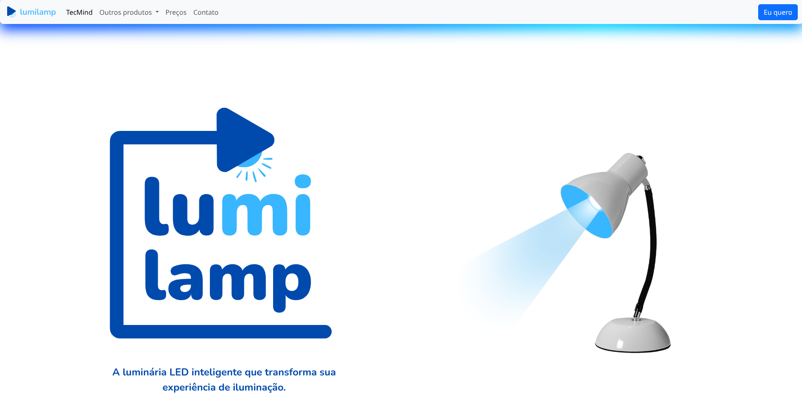
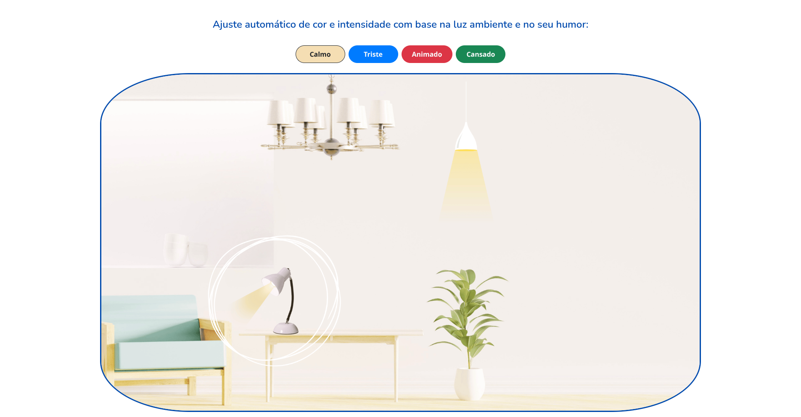
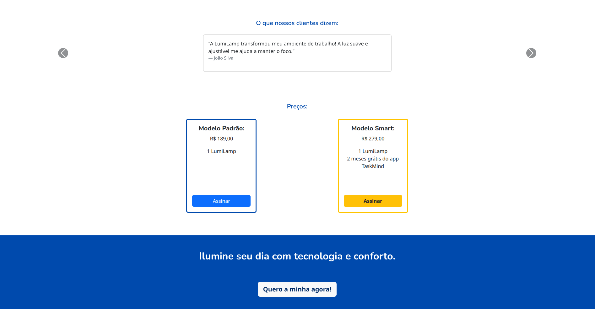
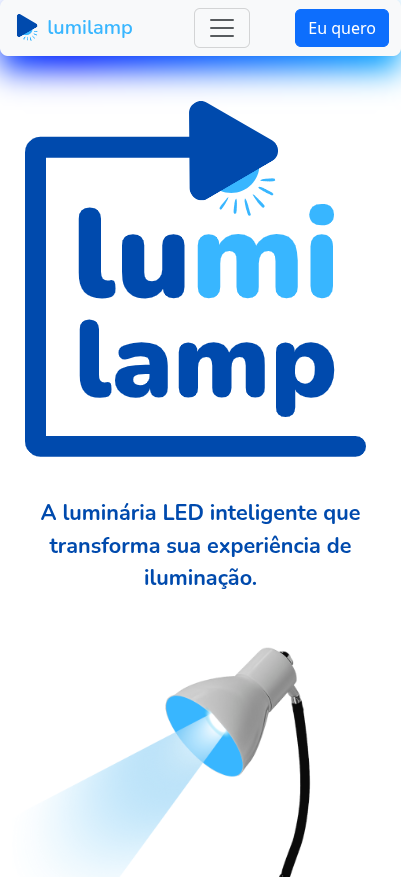
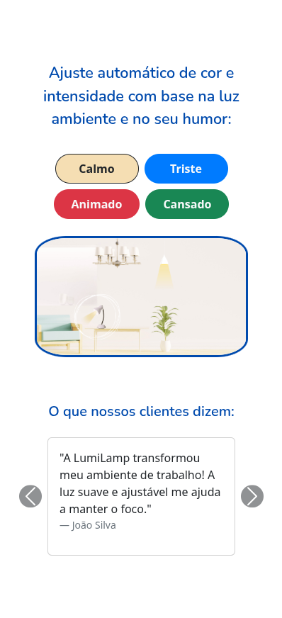
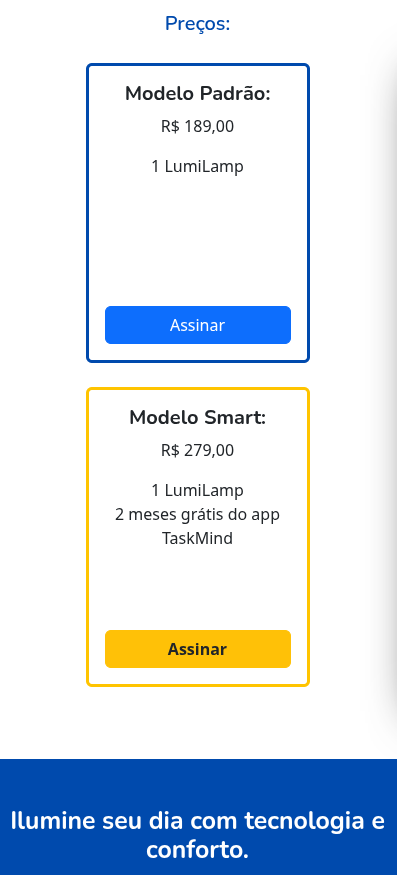

Desafio técnico desenvolvido para o processo seletivo de estágio em Front-End. O projeto foi construído com HTML, CSS e Bootstrap 5, com foco em layout responsivo e organização semântica de código.

# LumiLamp

Uma landing page responsiva e interativa para apresentar a **LumiLamp**, uma luminária LED inteligente que se adapta ao ambiente e ao seu humor. Desenvolvida com foco em usabilidade, clareza e responsividade, esta página foi criada utilizando **HTML5**, **CSS3** e **Bootstrap 5**, seguindo o paradigma **Mobile-first**.

---

## Descrição:

O projeto tem como objetivo apresentar de forma elegante e funcional um produto de tecnologia: a **LumiLamp**. A página segue uma estrutura clara, com foco na experiência do usuário, sendo totalmente adaptável a diferentes tamanhos de tela — de dispositivos móveis a desktops.

Todos os componentes da interface foram desenvolvidos com **Bootstrap 5**, sem uso de bibliotecas externas, conforme os critérios estabelecidos no desafio técnico.

---

## Estrutura da Página

A estrutura foi desenvolvida de forma objetiva e funcional:

- **Header:** Navegação clara e responsiva com menu colapsável.
- **Apresentação Principal:** Destaque da marca e slogan com imagem ilustrativa.
- **Funcionalidades:** Mudança de fundo com base no estado emocional do usuário (interatividade com botões).
- **Depoimentos:** Carousel responsivo com feedbacks de clientes.
- **Tabela de Planos:** Cartões com preços e benefícios dos modelos disponíveis.
- **Chamada para Ação:** Seção de destaque incentivando a compra.
- **Footer:** Informações institucionais e links úteis.

---

## Tecnologias Utilizadas

- HTML5
- CSS3
- Bootstrap 5.3
- JavaScript Vanilla (Frontend apenas)
- Mobile-first Design

---

## 🖼️ Prints da Aplicação

### Versão Desktop





### Versão Mobile





---

## O que não foi utilizado (em conformidade com o desafio)

- Nenhum framework/backend (Node, Express, PHP, etc.)
- Nenhum banco de dados ou persistência de dados
- Nenhuma biblioteca externa como Tailwind, Material UI, jQuery ou afins
- Apenas HTML, CSS e Bootstrap 5 conforme exigido

---

## Como visualizar o projeto

Você pode clonar este repositório:

```bash
git clone https://github.com/leogmc/LumiLamp-front-TaskMind.git
cd lumilamp

